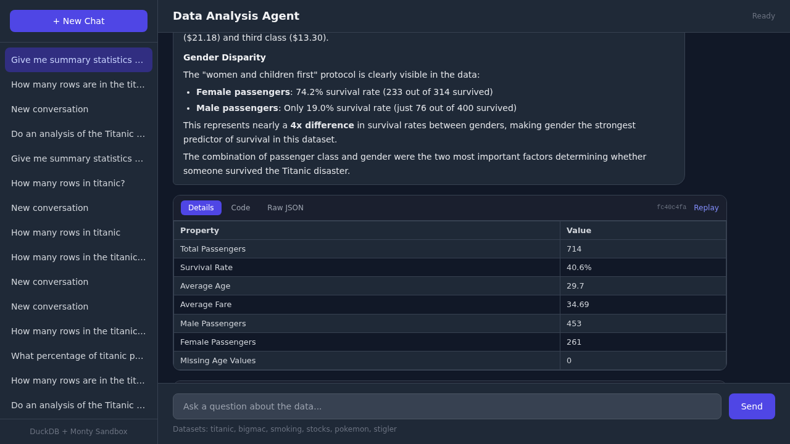
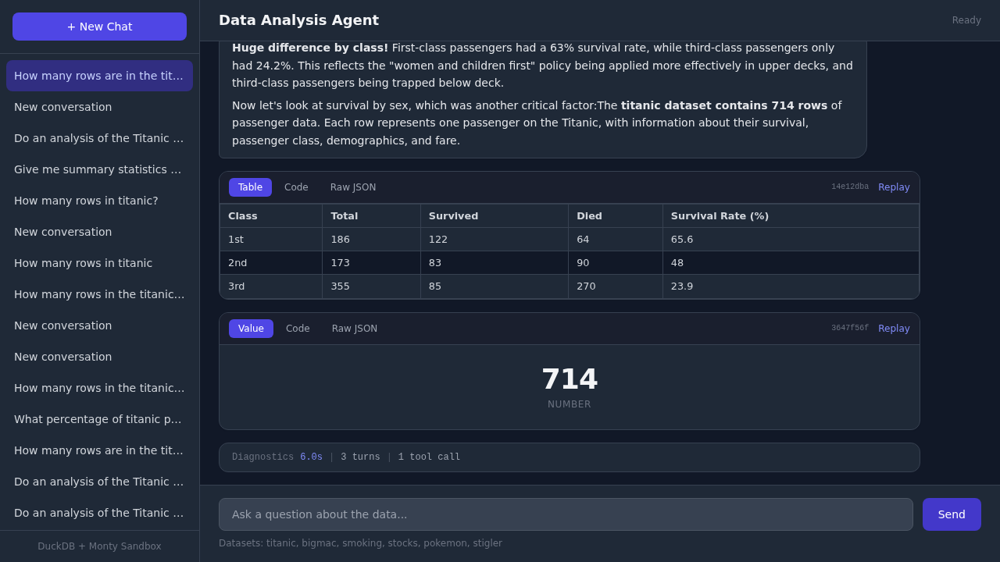

# sandbox-agent

A chat-based data analysis agent that runs LLM-generated Python code in a sandboxed interpreter. Built with [Pydantic Monty](https://github.com/pydantic/monty) for code execution and [DuckDB](https://duckdb.org/) for data storage.



## What it does

You ask questions about data in natural language. Claude generates Python code, which runs inside Monty — a sandboxed Python interpreter written in Rust. The code can query datasets through a locked-down interface (`fetch`, `count`, `describe`, `tables`), but has no access to the filesystem, network, or host process.

Results are classified by shape and rendered accordingly:

- **Tables** (list of dicts) — interactive HTML data tables
- **Key-value pairs** (dict) — two-column property sheets
- **Metrics** (scalar) — large styled values



The agent can produce multiple result cards per turn with narration between them, and each card includes tabs for the rendered result, source code, and raw JSON.

## How the sandbox works

Monty is not `eval()`. It's a purpose-built Python subset interpreter compiled to a native Rust extension. The execution model:

1. Claude generates Python code
2. Monty parses and compiles it (syntax errors caught here)
3. The interpreter runs the code. When it encounters a call to `fetch()`, `count()`, etc., it **pauses** and yields control back to the host
4. The host validates the request, builds a SQL query, runs it on DuckDB, and feeds the result back
5. The interpreter resumes with the return value

The sandbox code never touches DuckDB directly. The host controls exactly what data flows in and out through registered external functions.

### What the sandbox can't do

- No `import` statements (the language doesn't support them)
- No class definitions, `try`/`except`, `with`, or generators
- No filesystem or network access
- No access to the host Python process
- Configurable resource limits: execution timeout, memory, allocations, recursion depth

## Datasets

Six datasets are loaded from CSV at startup via DuckDB:

| Dataset | Rows | Description |
|---------|------|-------------|
| titanic | 714 | Passenger survival data |
| bigmac | 1,330 | Big Mac Index by country |
| smoking | 1,314 | Health data (Simpson's paradox) |
| stocks | 4,276 | MSFT/KLM/ING/MOS daily prices |
| pokemon | 800 | Name, type, stats |
| stigler | 77 | Stigler's diet optimization |

## Setup

Requires Python 3.12+ and an [Anthropic API key](https://console.anthropic.com/).

```bash
# Clone and install
git clone <repo-url>
cd sandbox-agent
uv sync

# Configure
cp .env.example .env
# Edit .env and add your ANTHROPIC_API_KEY

# Run
just serve
```

Open http://localhost:19876 in your browser.

## Development

```bash
just fc          # format, lint, type-check, test (pre-commit workflow)
just test        # run tests only
just lint        # ruff check
just fmt         # ruff format
just type        # ty check
```

## Architecture

```
src/sandbox_agent/
├── main.py              — FastAPI app with lifespan management
├── config.py            — Configuration (env vars + defaults)
├── api/routes.py        — SSE streaming chat endpoint, conversation CRUD
├── agent/
│   ├── client.py        — Claude Agent SDK integration, tool definitions
│   └── prompts.py       — System prompt with sandbox docs and result format guidance
├── sandbox/
│   ├── executor.py      — Monty compilation, execution loop, result classification
│   └── functions.py     — External function dispatch (fetch, count, describe, tables)
└── data/
    ├── duckdb_store.py  — In-memory DuckDB with dataset loading
    └── sqlite_store.py  — Conversation and artifact persistence

static/index.html        — Chat UI (Tailwind CSS, vanilla JS, SSE)
```

## Agent affordances

The agent communicates through a small set of SSE event types streamed to the frontend:

| Event | Source | Description |
|-------|--------|-------------|
| `text` | Claude `TextBlock` | Narration, analysis, or explanation |
| `code` | Claude `ToolUseBlock` | Python code about to run in the sandbox |
| `artifact` | Orchestration | Execution result (table, dict, scalar, or error) paired with the code that produced it |
| `status` | Orchestration | Hardcoded progress indicators ("Running code in sandbox...", "Analyzing results...") |
| `done` | Orchestration | End-of-turn signal with artifact IDs and timing data |

Claude itself only emits two kinds of content blocks — text and tool calls. The orchestration layer (`agent/client.py`) inspects each block, routes it to the appropriate SSE event type, and manages the execute → result → resume loop via the Claude Agent SDK. Status messages are not LLM-controlled; they're fixed strings emitted at known points in the execution pipeline.

The frontend renders each turn as a sequence of discrete phases (text, code+result, diagnostics) with subtle visual separators, preserving the order the agent produced them.

## Stack

- **LLM**: Claude via [Claude Agent SDK](https://github.com/anthropics/claude-agent-sdk)
- **Sandbox**: [Pydantic Monty](https://github.com/pydantic/monty) (Rust-based Python interpreter)
- **Data**: [DuckDB](https://duckdb.org/) (in-memory analytical database)
- **Backend**: FastAPI + SSE streaming
- **Frontend**: Vanilla JS + Tailwind CSS
- **Storage**: SQLite (conversations and artifacts)

## License

MIT
